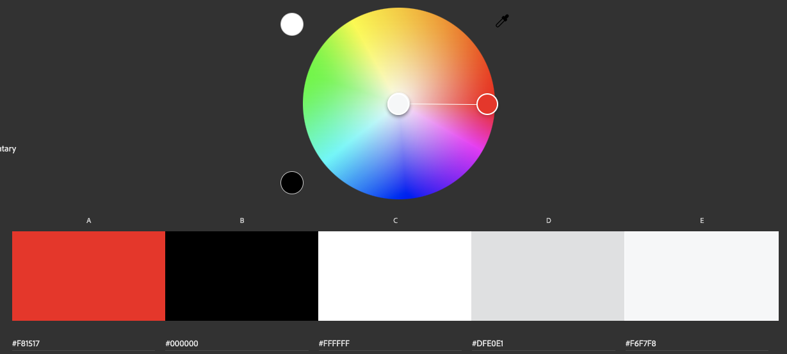

# Love Body
(Developer: Maksims Buraks)

[live web-page](https://maksimb96.github.io/LoveBody/)

## Table of contents

1. [Project Goals](#project-goals)
    * [User Goals](#user-goals)
    * [Site Owner Goals](#site-owner-goals)
2. [User Experience](#user-experience)
    * [Target Audience](#target-audience)
    * [User Requirements and Expectations](#user-requirements-and-expectations)
    * [User Stories](#user-stories)
3. [Design](#design)
    * [Design](#design-choices)
    * [Color](#colors)
    * [Fonts](#font)
    * [Structure](#structure)
    * [Wireframe](#wire-frame)
4. [Tech Used](#tech-used)
    * [Languages](#languages)
    * [Tools](#tools)
5. [Features](#features)
6. [Code Validation & Testing](#validation)
    * [Html](#html-validation)
    * [Css](#css-validation)
    * [javascript](#js-validation)
    * [Acessability](#acessability)
    * [Perforamnce](#performnce)
    * [User Story Testing](#user-story-testing)
7. [Bugs](#bugs)
8. [Deployment](#deploy)
9. [Future Features](#future-features)
10. [Credits](#credits)
11. [Acknowledgements](#acknowledgements)

## Project Goals

### User Goals
    -Finding a site that provides a fun way to test users fitness knowledge
    -To test training knowledge
    -To test nutrition knowledge
    -Find a way to leave feedback to improve quiz

### Site Owner Goals
    -Provide a simple and fun way to test visitor knowledge 
    -Provide an area to leave feedback
    -Make sure contact deetails being left are real people

## User Experience

### Target Audience
    -People looking to test fitness Knowledge
    -People looking to test nutrition Knowledge

### User Requirements and Expectations
    -A simple and natural way to navigate the website
    -Quick acessibility to relevant information
    -Appealing design that responds accordingly
    -A simple way to get in contact, and leave feedback
    -Accessibility

### User Stories

#### First-time User
1. As a first time user, I want to test my fitness knowledge
2. As a first time user, I want to test my nutrition knowledge
3. As a first time user, I want information presented in one location
4. As a first time user, I want to leave feedback for further addition of questions

#### Returning User
5. As a returning user I want to refresh my knowledge on fitness
6. As a returning user I want to refresh my knowledge on nutrition
7. As a returning user I want to see additional quesstions added
8. As a returning user I want to be able to locate relevant social links

#### Site Owner
9. As a site owner I want people to locate relevant information to the quiz
10. As a site owner I want people to be able to play as many times 
11. As a site owner I want individuals to get in contact

## Design

### Design Choices
The website was developed in such a way that had a minimal and colourful approach that is not too much to overload the senses. It has all relevaant information on the home page that allows users to jump directly to the relevant points of interest.

### Colour
Color Choices contain a slightly colder shade of greens and neutral greys and white to compliment all elements. A less satturated green was used as many associate the higher saturated colors with 'vegan'. Highlight color of oraange was used as it plays well with the secondary colors.
 

### Fonts
Solway with a serif fall back was used as the main head text as it provides a nice playful and approachable flair to the website
 
Roboto with sans-serif fall back was used as it compliments solway and contrasts to its playful style without being out of place. It is also clear and concise.

### Structure
The Structure of the website is a clean and minimal approach as the main focus of the website is the quiz. Therefore the index page allows for ease of access to all relevant info. The nav bar is clean and simple with all elements being clear and intuative.

 

The website is made up of 3 pages:

    -The home page that draws a user and links directly to other points of interest. 
    -The fitness quiz page that contains the quiz script.
    -A contact page that allows easy contact, validation.

### Wireframes

Home

Quiz

Feedback

-Tablet view is exactly the same as desktop!

## Tech Used

### Languages
    -HTML
    -CSS
    -Java Script

### Tools
    -Git
    -Git Hub
    -Git Pod
    -Balsamiq
    -Google Fonts
    -Adobe Color Wheel
    -Font Awesome
    -Favicon.io
    -Circle Crop
    -EmailJs
    -Canva
    -Boot strap
    -pixelr

## Features
The Website consists of 3 pages with 11 features

### Logo and Nav-Bar/ Home buttons
    -featured on all three pages
    -Home page Icons have zoom effect and has all info on one page to prevent excessive travel
    -Nav bar is fully responsive and changes to a burger style on mobile devices. Nav bar links to all relevant pages allowing for quick access.
    -Nav bar has selected item in order to give clear feedback to location as well as hover.
    -Pages 2/3 have a slight difference in appearance but over all same design in order to not disrupt immersion.
    -User stories adressed: 3, 9.
    

 

 

### Footer
    -footer conistent on all pages with hover effect in order to provide clear feedback on selection
    -User stories adressed: 8.

### Quiz page
    -Clear UI
    -Tracks score
    -Cycles through questions and allows to restart when questions exhaust.
    -Clear visuals for correct/incorect selections
    -Quiz incrementss score 
    -User stories adressed: 1, 2, 5, 6, 10.

### Feedback Form
    -Allows users to leave feedback for improvement of quiz etc.
    -Form validates email and name (full name and proper email)
    -Form Sends back email to me as soon as user leaves feedback
    -User stories adreessed: 4, 7, 11. 

 

 

 

 

 

## Validation

### HTML Validation
W3C mark-up was utilised in order to validate html of the website. All Pages pass with no errors. Warnings are related to various segments not using Headings, but utilise div elements.

Index

Fitness Quiz

Feedback

 

### CSS Validation
W3C CSS validator was utilised in order to make sure the css code passes standards with no errors.

Full Document

 

### JS Validation
JSHint validator was utilised in order to make sure the javascript code passes standards with no errors or warnings, All functions marked as "unused" are called on click in HTML code segments, images of relevnt code is attached to validations.

Index

Fitness Quiz

Feedback

 

### Accessability
Wave WebAIM was utilized in order to make sure the website met high accessability standards. All pages pass with no errors or contrast errors. Warnings are due to things such as logo having the same link as the hom, which is an intentional feature. The form segment states the labels are not owned by input eventhough they have been propeerly attributed.

Index

Fitness Quiz

Feedback

 

### Performance
Google light house was used in order to confirm good standards of performace

Index

Fitness Quiz

Feedback

 

### Tests

#### Devices tested on on:
    -Iphone SE, XR, 11, 12, 13
    -Ipad
    -Macbook Pro/Air
    -Lenovo Platform
    -Dell Platform

#### Browser tested on on:
    -Chrome
    -Mozilla
    -Safari
    -Brave/Brave Mobile

### Testing User Stories

1. As a first time user, I want to test my fitness knowledge

2. As a first time user, I want to test my nutrition knowledge

5. As a returning user I want to refresh my knowledge on fitness

6. As a returning user I want to refresh my knowledge on nutrition

7. As a returning user I want to see additional questions added

3. As a first time user, I want information presented in one location

4. As a first time user, I want to leave feedback for further addition of questions

9. As a site owner I want people to locate relevant information to the quiz

10. As a site owner I want people to be able to play as many times

11. As a site owner I want individuals to get in contact

 

| **Feature** | **Action** | **Expected Results** | **Final Result** |
|-------------|------------|----------------------|------------------|
|             |            |                      |                  |
| Home page, Linked Icons| Burger Menu/ Desktop menu show relevant info, icons link to poi's| Interactive Elements prompt to trravel to relevant poi's| Home page prompts user to travel to all locations from home page|
|Quiz| Allows user to test knowledge in relation to fitness| Clear visual indicators for correct/wrong answer, questions cycle and then reset as intended|Quiz Works as intended|
|Feedback Form| Input fields only submit once form validated| Form validates inputs and sends feedback to me| Form Works as intended|

Screenshot

 

8. As a returning user I want to be able to locate relevant social links

| **Feature** | **Action** | **Expected Results** | **Final Result** |
|-------------|------------|----------------------|------------------|
|             |            |                      |                  |
|Social Media Links|User has access socials| Functional links| Works as intended|

Screenshot

 

## Bugs

| **Bug** | **Fix** | 
|---------|---------|
|         |         | 
|Restart Scores did not work as intended| Created new button instead of changing inner html and defind it, and added functions that reset score on click via event listener|
|Form not validating|Added correct string in order validate |
|Initial break of quiz| Corrected elements by id and programmed restart button and function correctly|

## Deployment

Deployment of site was acheived through these steps:
1. I navigated to the settings section on git hub repositories on my repository.
2. I then selected the pages link on the left side.
3. I then selected source for the branch prompt.
4. Roughly, 2 minutes after refreshing I recieved a link to my site: https://maksimb96.github.io/LoveBody/ 

## Future Features

There are a few more feartures that I would like to implement in the future. These Include:
1.Polished Nav Bar with smooth transition
2.Timer function to quiz
3.Randomize the order of how button answers display
4.A progress Bar to track progress

## Credits

### Media

All media created by me using  <a href="https://www.canva.com/">Canva</a>, this includes Icons and backgound images.
 
Any Icons used found on <a href="https://fontawesome.com/">Font Awesome</a>
 
Burger Image by <a href="https://www.flaticon.com/free-icon/menu_4254068?term=menu-burger&page=1&position=2&page=1&position=2&related_id=4254068&origin=tag#">Andy Horvath</a>
 
X Image by <a href="https://www.flaticon.com/free-icon/close_2997911?term=x&page=1&position=5&page=1&position=5&related_id=2997911&origin=tag# ">Fuzzee</a>
    
### Code 

1. 404 page code provided by Mo Shami_mentor from code institue
2. favicon idea provided by Mo Shami_mentor, site used found <a href="https://favicon.io/"> here</a>
3. Form Validation inspiraation by <a href="https://www.youtube.com/watch?v=fz8bwvn9lA4"> Easy Tutorials</a>
4. Increment of answers inspired by LoveMaths by Code Institute
5. Text shadow property taken from <a href="https://www.w3schools.com/cssref/css3_pr_text-shadow.php"> w3schools</a>
6. Email Validation strings by <a href="https://www.w3resource.com/javascript/form/email-validation.php">W3Schools</a>
7. Burger Nav bar help from tutor support
8. Reset button functionality help from tutor support
9. EmailJs instructions may be found on <a href="https://www.emailjs.com/">EmailJS</a>
10. Quiz inspiration taken from  <a href="https://www.youtube.com/watch?v=riDzcEQbX6k">Web Dev Simplified</a>

## Acknowledgements

-I would like to thank Victor my mentor
 
-CI for provide me the knowledge to under-take this task
 
-Tutor Support for provideing better knowledge to implement the code!
 
-My beautiful girlfriend who almost got all my typos and My friend for design related advice
 
-The wonderful community over on Slack!

