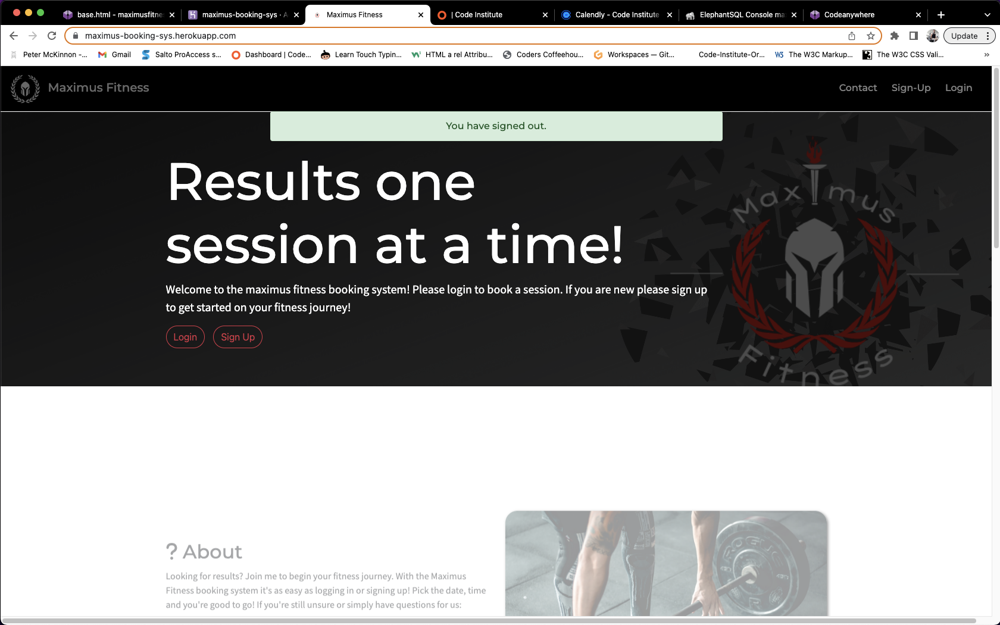

# Maximus Fitness Booking System

(Developer: Maksims Buraks)

[live web-page](https://maximus-booking-sys.herokuapp.com/)

## Table of contents

- [Maximus Fitness Booking System](#maximus-fitness-booking-system)
  - [Table of contents](#table-of-contents)
  - [Project Goals](#project-goals)
    - [User Goals](#user-goals)
    - [Site Owner Goals](#site-owner-goals)
  - [User Experience](#user-experience)
    - [Target Audience](#target-audience)
    - [User Requirements and Expectations](#user-requirements-and-expectations)
    - [User Stories](#user-stories)
      - [First-time User](#first-time-user)
      - [Returning User](#returning-user)
      - [Site Owner](#site-owner)
  - [Design](#design)
    - [Design Choices](#design-choices)
    - [Kanban-Board](#kanban-board)
    - [Colour](#colour)
    - [Fonts](#fonts)
    - [Structure](#structure)
    - [Wireframes](#wireframes)
  - [Tech Used](#tech-used)
    - [Languages](#languages)
    - [Tools](#tools)
  - [Features](#features)
    - [Logo and Nav-Bar](#logo-and-nav-bar)
    - 
    - [Index](#index)
    - [Contact Form](#contact-form)
  - [Validation](#validation)
    - [HTML Validation](#html-validation)
    - [CSS Validation](#css-validation)
    - [Python Validation](#python-validation)
    - [JS Validation](#js-validation)
    - [Tests](#tests)
      - [Devices tested on on:](#devices-tested-on-on)
      - [Browser tested on on:](#browser-tested-on-on)
  - [Deployment](#deployment)
  - [Future Features](#future-features)
  - [Credits](#credits)
    - [Media](#media)
    - [Code](#code)
  - [Acknowledgements](#acknowledgements)

## Project Goals

### User Goals

    -Finding a site that provides ability to book a one on one session
    -To Create Bookings
    -To Update Bookings
    -To Delete Bookings
    -To Manage Bookings
    -To Create Account

### Site Owner Goals

    -Provide a simple and clean approach to booking sessions
    -Provide an area to get in contact
    -To manage and confirm bookings

## User Experience

### Target Audience

    -People looking to book a session

### User Requirements and Expectations

    -A simple and natural way to navigate the website
    -Quick acessibility to relevant information
    -Appealing design that responds accordingly
    -A simple way to get in contact/book etc.
    -Accessibility

### User Stories

#### First-time User

1. As a first time user, I want to book a session
2. As a first time user, I want easy intuative navigation
3. As a first time user, I want information presented in one location
4. As a first time user, I want to get in contact for more info

#### Returning User

5. As a returning user I want to sign back in 
6. As a returning user I want to update bookings
7. As a returning user I want to view bookings
8. As a returning user I want to delete bookings

#### Site Owner

9. As a site owner I want people to locate relevant information to booking
10. As a site owner I want people easily book and manage sessions
11. As a site owner I want the ability to update or confirm bookings

## Design

### Design Choices

Website design took into consideration company colors and elements. The website follows a clean and minimal design in order to make readability and accesability easy. Which follows the motto of minimal fitness. A clean layout with relevant information.

### Kanban-Board

A kanban board was utilised to sub divide each story into an epic (3 in total) This helped spped development up with clear cut goals can be loacted in the projects tab!

### Colour

Color choices for this project again were based solely on the company colors, being red/black/white with different shades  of grey to help accent element.

 

### Fonts

Montserrat, with a fall-back of sans-serif was used along with "Source Sans Pro", with the sans-serif fall-back. These were chosen because they evoke a modern and clean look, along with complementing geometry!

### Structure

The Structure of the website is a clean and minimal approach as the main focus of the website is the Crud Functionality Therefore the index page allows for ease of access to all relevant info. The nav bar is clean and simple with all elements being clear and intuative. The Index is the most animated, as the goal is to draw in people and be more welcoming. Clean design maintained throughout.

 

The website is made up of 8 pages:

    -The User authenticated segments 
    -The Index
    -The CRUD Functions

### Wireframes

Home

Book

Manage

Update/Delete

Core functionality and views remain the same throughout. Sign in/login pages are custom 

-Tablet view is exactly the same as desktop!

## Tech Used

### Languages

    -HTML
    -CSS
    -Java Script
    -Pyhton
    -Django
    

### Tools

    -Git
    -Git Hub
    -Git Pod
    -Balsamiq
    -Google Fonts
    -Adobe Color Wheel
    -Font Awesome
    -Favicon.io
    -Circle Crop
    -EmailJs
    -postgresql
    -psycopg
    -Canva
    -Boot strap 4
    -ScrollReveal function
    -pixelr
    -Django
    -SummerNote
    -Crispy Forms

## Features

### Logo and Nav-Bar

    -featured on all three pages
    -Options changed based on user authentication
    -Nav bar is fully responsive and changes to a burger style on mobile devices. Nav bar links to all relevant pages allowing for quick access.
    -Subtle animation for selected
    -Pages 2/3 have a slight difference in appearance but over all same design in order to not disrupt immersion.-
    relevant links lead to full Crud

    

 

 

### 

    -footer conistent on all pages with hover effect in order to provide clear feedback on selection
    

### Index

    -Clear UI
    -Responsive
    -Scroll reveal adds dynamic element to page
    -message handeling
   

.png)

### Contact Form

    -Allows users to leave feedback for general queries and concerns
    -Form validates email and name (full name and proper email)
    -Form Sends back email to me as soon as user leaves feedback
    -Clear feedback

 

## Validation

### HTML Validation
W3C mark-up was utilised in order to validate html of the website. All Pages pass with no errors. Warnings are related to various segments not using Headings, but utilise div elements.

Index

login

logout

Manage

Sign-Up

Delete

 

### CSS Validation
W3C CSS validator was utilised in order to make sure the css code passes standards with no errors.

Full Document

 

### Python Validation

CI Python linter used here

Forms

Model

View

### JS Validation
JSHint validator was utilised in order to make sure the javascript code passes standards with no errors or warnings, All functions marked as "unused" are called on click in HTML code segments, images of relevnt code is attached to validations.

Email Js And Script

 

### Tests
-login/Crud Functionality functionality:
    
    
    
    
    
    

#### Devices tested on on:
    -Iphone SE, XR, 11, 12, 13
    -Ipad
    -Macbook Pro/Air
    -Lenovo Platform
    -Dell Platform

#### Browser tested on on:
    -Chrome
    -Mozilla
    -Safari
    -Brave/Brave Mobile

## Deployment

Deployment of site was acheived through these steps:
    -before deployment we soft deploy.
    -This means set up all vars relating to urls and databases and configure the variables
    -After Project completion and soft launch disable, disable_collect static and make sure debug is false
    -Once all is in place commit changes to git hub, followed by deployment to Heroku
    -Once deployment of site is complete you are provided with your app url!

## Future Features

There are a few more feartures that I would like to implement in the future. These Include:
1.Further Form Validation
2.Implement Send_mail
3.Add pt packages segment
4.A Feedback Section/ Possibly rating system

## Credits

### Media

All media created by me using  <a href="https://www.canva.com/">Canva</a>, this includes Icons and backgound images.
 
Any Icons used found on <a href="https://fontawesome.com/">Font Awesome</a>
 

    
### Code 

1. Booking System Inspiration SelmiTech : <a href="https://www.youtube.com/watch?v=3_3q_dE4_qs&t=649s">Youtube</a>
2. Preloader idea : <a href="https://www.youtube.com/watch?v=Yf5d_Zx3AaI">Youtube</a>
3. ScrollReveal() function : <a href="https://www.youtube.com/watch?v=ePgnR4gHIi4">Youtube</a>
4. Carousel ideas : <a href="Carousel">Codepen</a>
5. Understanding Widgets : <a href ="https://simpleisbetterthancomplex.com/tutorial/2019/01/03/how-to-use-date-picker-with-django.html">Here</a>
6. Heavy inspiration from CI Hello Django and Blog Walkthrough
7. Bootstrap Documentation
8. Django Documentation
9. EmailJs instructions may be found on <a href="https://www.emailjs.com/">EmailJS</a>

## Acknowledgements

-I would like to thank Victor my mentor
 
-CI for provide me the knowledge to under-take this task even though-it broke down near the end we still salvaged it
 
-Tutor Support for provideing better knowledge to implement the code! Especially Ed, Josh Oisin
 
-My beautiful girlfriend who almost got all my typos!
 
-The wonderful community over on Slack!
 
-Coffeee for keeping me up 38hrs straight trying to figure asset load errors
